## **Remix IDE & its features**

Welcome to the [remix ide](https://remix.ethereum.org).

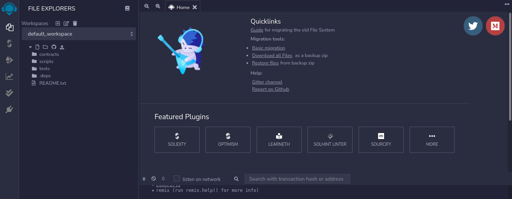

This is where we start to work with solidity and smart contracts and deploy them to blockchains.

There are a bunch of solidity plugins like Solidity, Learneth, Solhinthinter, and more. But we're going to go ahead with solidity.We're going to create a little application that can store information on the blockchain for us.So we're going to create a new file (.sol).

Solidity's compiler tab (Eth looking like on the tab) compiles all the solidity code down to machine understandable code or machine language. Here's a whole bunch of parameters we can choose when working with solidity, like compiler version, choosing the language, and evm version. So let's code our first solidity contract.

We're going to use something a little bit special here when we deploy the code. We're going to use `JavaScript VM` which simulates actually deploying to a test net or a real network. We're not actually going to deploy on a real network.We'll get into it in a little bit, but just to get started, we're going to work with the JavaScript VM, which is kind of a fake environment for now.

Testing locally and understanding how to test locally will make your coding experience a lot faster. As you saw, when we sent some transactions, some of them actually took a lot of time to deploy. We don't want to have to spend that much time waiting around for our tests to actually finish. 

**Solidity version**

The first thing that you're going to need in any solidity program is the solidity version. That's always going to be at the top of your solidity code.It is defined by:

Ctrl + s will save and "compile".

If we want a specific version of solidity, we could also do:

But for this, if we just hit CTRL + S, it'll try to compile on the previous compiler version. This might give an error. You need to click the "Compile" button for the compiler to automatically switch to the specific compiler version.

We can also do:

`pragma solidity ^0.6.0;`

which allows us to work with any version of 0.6.

We'll be working with compiler version 0.6.0.However, in future contracts that we work on, we're actually going to work with different versions of solidity. The reason we're going to be changing versions throughout the journey is that solidity is a constantly updating language. Being good at switching between versions is going to make you an incredibly powerful smart contract engineer.

**Defining a Contract**

To define our contract:

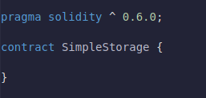

"Contract" is a keyword in solidity. You can think of a contract as similar to a class in Java or any other OOP language. Here, "SimpleStorage" is the name of the contract.

You could hypothetically deploy this right now, and this would be a valid contract.

**Variable types & Declaration**

In solidity, there are many different types that we can work with. Let's go into some of the types of solidity we can have.

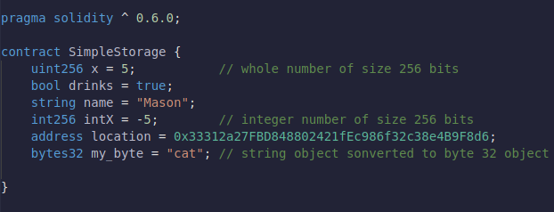

You can also do:

`uint x = 5;`

But if you want to be a little more precise, a lot of protocols and smart contracts will do whole names like `uint256`.

We can also do bytes1, bytes2, up to bytes32.

**Solidity Documentation**

If you want to learn more about the different types and the different variables that you can use, head over to the [solidity documentation](https://docs.soliditylang.org/en/v0.8.11/).

**Initializing**

Even if I didn't manually initialize to 5, it'd get initialized to a null value. For now, let's just not initialize it to anything. That way, it'll be automatically initialized to zero. This means when we deploy this contract as of right now, x will start off as zero.

**Functions or methods**

Functions or methods are self contained modules that will execute some task for us, and in solidity, it's the exact same thing they're defined by:

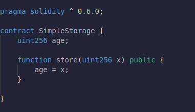

This is, in its simplest form, how you can define a function. This function sets whatever value (whole number) we pass to the age. 

**Deploying a Contract**

So let's go ahead and actually deploy this contract to interact with it.

If we hit the ETH looking button, which will bring us to the deploy tab and will allow us to deploy our smart contract.

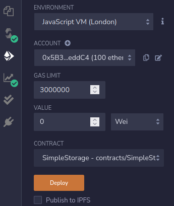

Using our JavaScript VM, it's given us a fake account with some ether in it. It has 100 ether in it to begin with, and as before, whenever we want to interact with the blockchain, we must pay a small amount of gas, even in our fictitious virtual machine here.We want to simulate that, so you'll see it has some of the same parameters here as making a transaction, like gas limit, for example.

When we deploy a contract, it's going to cost a little bit of ethereum or a little bit of gas to do so.Let's go ahead and click the deploy button.

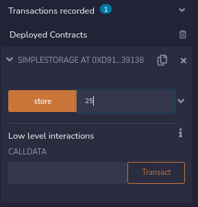

We can look at all the transactions we've recorded.We can see it says "Deployed Contracts" and we've got our contract.

In this SimpleStorage Contract, we see this big store button because there's one public function that we can actually interact with. So we can add 25 there. We hit the store and look at our contract that we've paid a little bit more gas to interact with the function.

Anytime we want to make a state change in the blockchain, we have to pay a little bit of gas. The reason metamask isn't popping up is because we're kind of doing it in this simulated environment.

**Public , Internal, private , External Visibility**

This is great, but it looks like we can't actually see what our age is. We can't actually look at it.So how do we actually make sure that we can view the age?

If we add public to our age, we recompile, delete our previous contract, and redeploy, and we can see the buttons pop up.

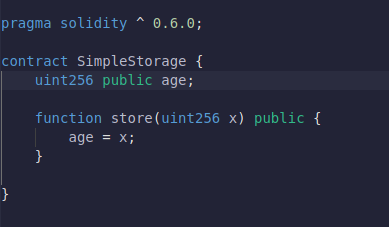

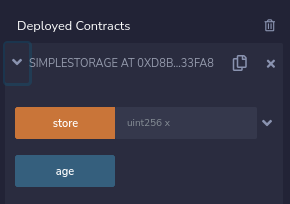

Let's talk about why this public variable allowed us to see this new button on this age button.

This `public` keyword defines the visibility of the variable or the function. There are currently four different types of visibility.

- External: 

An external function means it can't be called by the same contract. It has to be covered by an external contract.

- Public:

Public functions can be called by anybody, including variables. Oddly enough, variables are a function call to just look at them and return whatever that variable is. 

- Internal:

Internal functions can only be called by other functions inside of their existing contract or in their derived contract.

- Private:

Private is the most restrictive, as private functions and state variables are only visible for contracts they are defined in and not derived contracts.

The reason that we didn't see age in our original contract deployment is that if we don't give a state variable visibility, it'll automatically get set to "internal".

**Modifying a Variable**

If we hit the age button, it shows the value  of age is 0. The store function is set so that whatever value (whole number) we pass it, it's going to change age to the value we pass it as.

If we pass 5, hit the store, that transaction goes through, and then the age, we can see the value is now 5.

I'll be using transactions, smart contract interactions, and function calls a little bit 

interchangeably.That's because on a blockchain, whenever you call a function or whatever, you make some state change to the blockchain, you're actually also making a transaction. That's what makes this whole thing powerful, and again, that's why making a function call or deploying a contract costs a little bit of gas.

**Scope**

The reason we can access this age variable inside the store function is because age has this `global` or `contract` scope. If we make a variable inside a store function, we'd not be able to access it outside of a store function because it's self-contained inside the brackets`{}`.

**View functions**

You can also make a function called retrieve and make it a public function that is of type view and returns uint256.All this is going to do is return your favorite number.

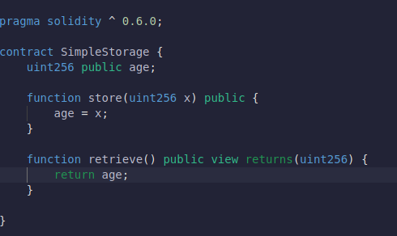

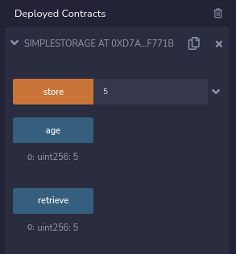

"Why does the store function have an orange color and the other two have blue? "

The key relies on the view function or view keyword. There are two special keywords that define functions that you actually don't have to make a transaction on. Those keywords are valid and pure.

**View functions**

A view function means that we want to read some state off the blockchain.We're just reading off the blockchain.If we're reading off the blockchain and we're not actually making a state change, then we don't need to make a transaction. These `blue buttons` are blue because they're view functions. Public variables also have view functions. That's why both of these are blue. The age variable is technically a view function. When I click it, I get to view the state of the variable.

**Pure functions**

Pure functions are functions that purely do some type of math.

We're doing some type of math above, but we're not actually saving any state anywhere. It's also going to have a blue button.

So for now, let's remove the public keyword from the age variable and work only with the retrieve function.

**Structs**

This application is great so far because it allows a single person to store an age and then retrieve it. But if we want a list of people or a group of people and want to store their age, or what if we want to associate an age with a single person?

We've got a whole number of different choices, but the one we're going to talk about is using a struct. 

"Struct" is a way to define new types of solidity. They're almost like creating new objects.

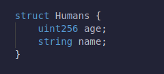

We've got a new type of people that has a favorite number and a name inside of it. Now what we could do with struct is:

Let's deploy this contract and see what it looks like:

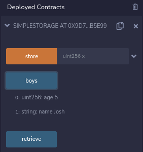

We've Humans struct which at the 0th index is the age and the 1st index is the name.

**Intro to Storage**

Storing variables in solidity always works in an above numeric index fashion. In fact, contract simple storage uint256 age is at index 0.

**Arrays**

Instead of just creating one person, we actually want to create a whole list of humans (boys in this case). So how do we create a list of people?

An array is a way of storing a list or a group of objects.

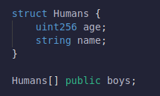

**Dynamic Array**

The array we created above is a dynamic array.It's a dynamic array because it changes its size. Right now it's of size 0 and if we add something to it, it's of size 1.

**Fixed Array**

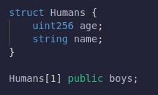

This array could only have a maximum of one boy inside of it.

We're going to work with a dynamic array because we want to add an arbitrary number of boys to it.

**Adding to an array**

Let's go ahead and create a new function called "add boy."

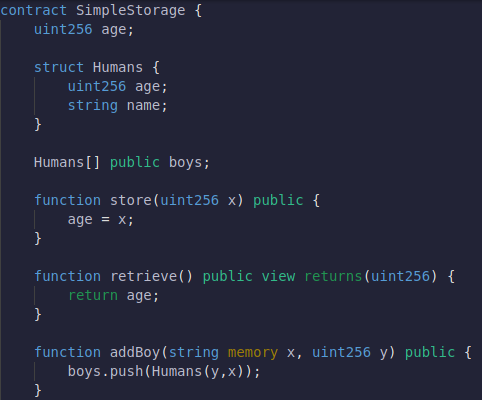

We can see our new function addBoys where we pass a string memory name and a uint256 age.Then we create a Humans object and we push it onto our boys array.

**Memory**

In solidity, there are more or less two ways to store information. You can store it in memory or in storage.

When you store an object in memory, it actually means that it'll only be stored during the execution of the function or of the contract call.

**Storage**

If we hold it in storage, that data will persist even after the function executes.String in solidity is actually technically not a value type. A string is actually an array of bytes. A variable of type string is actually a special type of array that we can append to.

Because it's technically an object, we've got to decide where we want to store it in memory or in storage. Since we only need a name during execution, we can have it be a string memory name. Then when we create this new Humans object, we'll create a new copy of the 'x' variable into storage.

Memory means after execution, delete this variable, and storage means keep it forever.

Let's deploy and see what happens now:

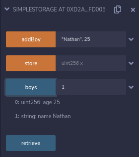

We've got this addBoys function, and since we're making a state change, here we can see that this indeed is an orange button instead of being a blue button.

**Mappings**

What if I'm looking for a boy's age from his name in the array?

Mapping takes some type of key and spits out whatever variable it's mapped to.

In our case, we want to find the age of the boy using his name.

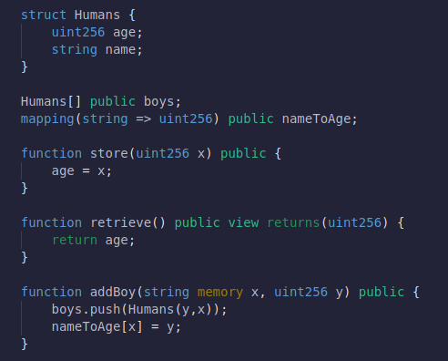

Let's deploy and see:

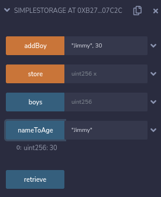

**SPDX License**

Typically, at the top of the contracts, you want to add an SPDX license identifier. Basically, the Solidity and Ethereum communities found out that trust in smart contracts can be better established if source code is available, and in terms of legality and copyright, it just makes life a lot easier if you add that license identifier right at the top of your solidity.

We're going to use the MIT license identifier because it's the most open license out there. It means anybody can use this code and we don't care.

`//SPDX-License-Identifier: MIT`

**Deploying to a live network**

We now have a contract that we've decided we like. It's got mappings, it enables us to actually store boys and their ages. We've done all of our testing in this JavaScript VM and we've decided, you know, we want to deploy this to an actual testnet or mainnet.

How do we actually deploy this so that other people can interact with this contract?

We're again going to use `Goerli Test Network` because that's what we used to make our first transaction. Now again, you'll need some type of test ether in your test wallet. If you get lost, you can always go to [Goerli faucet](https://goerli.etherscan.io/) or a better alternative would be to go to the link token contracts in the [chainlink documentation](https://docs.chain.link/docs/link-token-contracts/).

The only thing we need to change in the remix is that we need to change from JavaScript VM to Injected Web3 and Metamask will actually pop up.

Injected Web3 means we're taking our metamask and injecting it into the source code of the browser.Web3 provider is needed if we want to use our own blockchain node or web3 provider. When we do inject web3, we're saying our web3 provider is our metamask, which will work perfectly for what we're trying to do.

If you deploy the contract into the web3 provider, metamask will pop up asking if you want to do this transaction because, remember, we're deploying a contract, we're changing the state of the blockchain, so we have to pay a little bit of gas fee for it. We get a link to the Goerli Etherscan similar to what we saw before when we made a transaction. The difference here is that instead of sending ethereum to somebody, we're actually making a transaction on the blockchain to create a contract. After a short while, it'll show up in the status as "success". The number of block confirmations, which again is the number of blocks appended to the block that included our transaction,

**Interacting with Deployed Contracts**

As for working with the VM, we've got all the exact same functions here. However, if I click the store button, Metamask will pop up and do our transaction.

**EVM**

All the solidity code that we wrote and when we interacted with the blockchain, all the above solidity was compiled down to the EVM, also known as `Ethereum Virtual Machine`.A lot of the blockchains out there today are what's called `EVM compatible` which means that all the solidity and all the functions that we've created can still be compiled down to EVM and deployed on their blockchain.

You'll find out a little bit later when we look to work on a non-ethereum based chain that we can still deploy our solidity smart contracts to these other chains as well.

**Summary**

- first thing you always have to do in your smart contract is name the solidity version, then name a contract.

- A contract in Solidity is like a class and defines all the functions and parameters of your contract.

There are numerous types in solidity, including unsigned integers, booleans, bytes, strings, and others.

- We can create structs, arrays, mappings, functions in solidity.

- View functions don't make a state change.

- Memory and storage are two different ways to initialize where a variable is going to be saved.

- All the solidity code that we work with gets compiled down to EVM.

